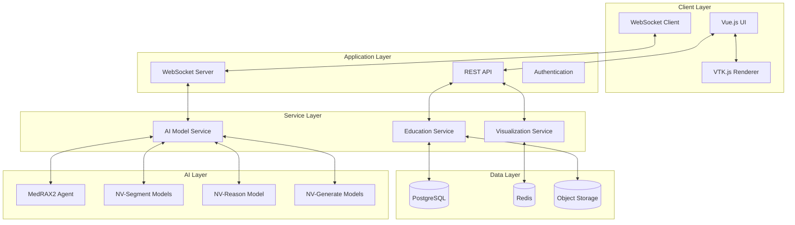
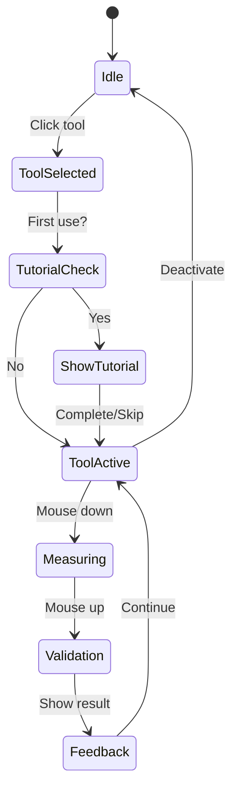
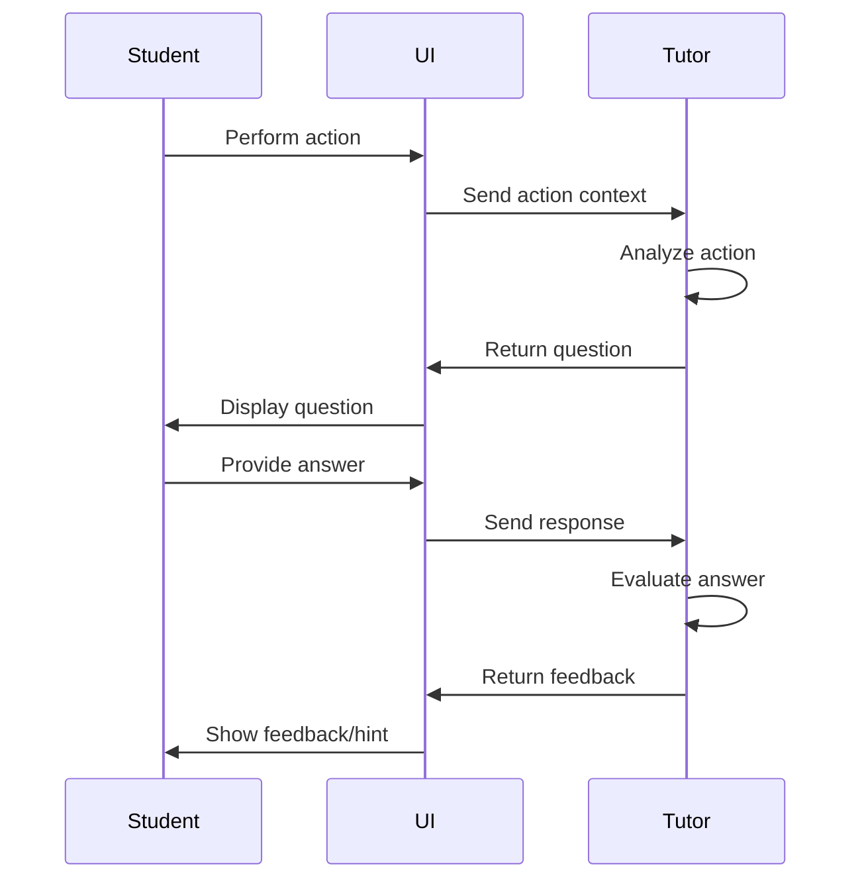

# RADSIM Technical Specification
## Radiology Simulator for Interactive Medical Education

**Document Type:** Technical Specification
**Version:** 1.0.0
**Status:** Draft
**Last Updated:** December 23, 2024
**Authors:** RADSIM Development Team

---

## Table of Contents

1. [Introduction](#1-introduction)
2. [System Requirements](#2-system-requirements)
3. [Functional Specifications](#3-functional-specifications)
4. [Technical Architecture](#4-technical-architecture)
5. [API Specifications](#5-api-specifications)
6. [Data Models](#6-data-models)
7. [User Interface Specifications](#7-user-interface-specifications)
8. [Integration Specifications](#8-integration-specifications)
9. [Performance Requirements](#9-performance-requirements)
10. [Security Specifications](#10-security-specifications)
11. [Testing Requirements](#11-testing-requirements)
12. [Deployment Specifications](#12-deployment-specifications)
13. [Acceptance Criteria](#13-acceptance-criteria)
14. [Appendices](#14-appendices)

---

## 1. Introduction

### 1.1 Purpose
This document specifies the technical requirements and implementation details for RADSIM (Radiology Simulator for Interactive Medical Education), a comprehensive radiology education platform that transforms the VolView GTC 2025 Demo into a "flight simulator" for radiology training.

### 1.2 Scope
RADSIM integrates:
- **VolView**: 3D medical imaging visualization platform
- **MedRAX2**: AI-powered Socratic tutoring system
- **NVIDIA Clara**: Medical AI models for segmentation, reasoning, and generation
- **Educational Framework**: Progressive learning system with assessment and tracking

### 1.3 Definitions and Acronyms
| Term | Definition |
|------|------------|
| RADSIM | Radiology Simulator for Interactive Medical Education |
| PACS | Picture Archiving and Communication System |
| DICOM | Digital Imaging and Communications in Medicine |
| MPR | Multiplanar Reconstruction |
| ROI | Region of Interest |
| Dice Score | Similarity coefficient for segmentation validation |
| LMS | Learning Management System |
| VQA | Visual Question Answering |
| WebSocket | Full-duplex communication protocol |

### 1.4 References
- VolView Documentation: https://volview.kitware.com
- NVIDIA Clara SDK Documentation
- MedRAX2 System Architecture
- Vue 3 Composition API Documentation
- VTK.js API Reference

---

## 2. System Requirements

### 2.1 Hardware Requirements

#### 2.1.1 Minimum Requirements
- **CPU**: Intel Core i5-8400 or AMD Ryzen 5 3600
- **GPU**: NVIDIA RTX 3060 (12GB VRAM)
- **RAM**: 16GB DDR4
- **Storage**: 256GB SSD
- **Network**: 100 Mbps broadband

#### 2.1.2 Recommended Requirements
- **CPU**: Intel Core i7-12700K or AMD Ryzen 7 5800X
- **GPU**: NVIDIA RTX 3090/4090 (24GB VRAM)
- **RAM**: 32GB DDR4/DDR5
- **Storage**: 1TB NVMe SSD
- **Network**: 1 Gbps connection

#### 2.1.3 Server Requirements
- **GPU Server**: NVIDIA L40S or A100 for model hosting
- **Memory**: 48GB+ VRAM for concurrent model loading
- **Storage**: 2TB+ for case library and models

### 2.2 Software Requirements

#### 2.2.1 Frontend Dependencies
```json
{
  "node": ">=18.0.0",
  "npm": ">=8.0.0",
  "vue": "^3.5.13",
  "vuetify": "^3.7.0",
  "@kitware/vtk.js": "^32.12.1",
  "pinia": "^2.0.34",
  "socket.io-client": "^4.7.1"
}
```

#### 2.2.2 Backend Dependencies
```toml
[tool.poetry.dependencies]
python = "^3.11"
torch = "^2.0.0"
transformers = "^4.51.3"
monai = "^1.3.0"
flask = "^3.0.0"
flask-socketio = "^5.3.0"
numpy = "^1.24.0"
pillow = "^10.0.0"
pydicom = "^2.4.0"
```

#### 2.2.3 Supported Browsers
- Chrome 100+ (recommended)
- Firefox 100+
- Safari 15+
- Edge 100+

### 2.3 Operating System Support
- **Development**: Linux (Ubuntu 20.04+), macOS 12+, Windows 10/11 with WSL2
- **Deployment**: Ubuntu Server 20.04 LTS, RHEL 8+
- **Client Access**: Any OS with supported browser

---

## 3. Functional Specifications

### 3.1 Core Features

#### 3.1.1 Educational Modes
| Mode | Description | Features |
|------|-------------|----------|
| **Tutorial** | Guided learning with step-by-step instructions | Real-time hints, visual cues, immediate validation |
| **Practice** | Self-paced exploration with on-demand help | Hint requests, post-submission validation |
| **Assessment** | Formal testing without assistance | No hints, timed sessions, certification tracking |

#### 3.1.2 User Roles
| Role | Capabilities | Access Level |
|------|--------------|--------------|
| **Student** | Complete tutorials, practice cases, take assessments | Basic |
| **Resident** | Advanced cases, peer review, create annotations | Intermediate |
| **Instructor** | Create cases, review submissions, manage curriculum | Advanced |
| **Administrator** | System configuration, user management, analytics | Full |

#### 3.1.3 Learning Features

**F-EDU-001: Progressive Case Library**
- **Requirement**: System SHALL provide categorized educational cases
- **Acceptance Criteria**:
  - Cases organized by difficulty (beginner/intermediate/advanced)
  - Filterable by modality, anatomy, pathology
  - Minimum 100 cases per specialty
  - Each case includes learning objectives

**F-EDU-002: Socratic Tutoring**
- **Requirement**: System SHALL integrate AI-powered Socratic tutor
- **Acceptance Criteria**:
  - Responds to student actions within 2 seconds
  - Provides contextual questions based on current view
  - Offers progressive hints after configurable delay
  - Tracks conversation history per session

**F-EDU-003: Real-time Validation**
- **Requirement**: System SHALL validate student annotations against ground truth
- **Acceptance Criteria**:
  - Calculate Dice score for segmentations
  - Measure accuracy within 5% for linear measurements
  - Provide immediate visual feedback
  - Generate detailed performance reports

**F-EDU-004: Tool Mastery Training**
- **Requirement**: System SHALL provide interactive tool tutorials
- **Acceptance Criteria**:
  - Step-by-step guidance for each tool
  - Practice exercises with validation
  - Proficiency tracking per tool
  - Unlock advanced tools based on mastery

### 3.2 Visualization Features

**F-VIS-001: Multi-planar Reconstruction**
- **Requirement**: System SHALL display medical images in multiple planes
- **Acceptance Criteria**:
  - Synchronized axial, sagittal, coronal views
  - Real-time crosshair positioning
  - Adjustable slice thickness
  - Save custom view configurations

**F-VIS-002: 3D Volume Rendering**
- **Requirement**: System SHALL provide GPU-accelerated 3D visualization
- **Acceptance Criteria**:
  - Interactive rotation and zoom
  - Preset transfer functions by modality
  - Clipping planes for isolation
  - Frame rate ≥ 30 FPS for 512³ volumes

**F-VIS-003: Annotation Overlays**
- **Requirement**: System SHALL overlay educational annotations
- **Acceptance Criteria**:
  - Highlight regions of interest
  - Display measurement guides
  - Show ground truth comparisons
  - Support multiple annotation layers

### 3.3 Assessment Features

**F-ASMT-001: Performance Tracking**
- **Requirement**: System SHALL track detailed performance metrics
- **Acceptance Criteria**:
  - Record all student interactions with timestamps
  - Calculate accuracy scores in real-time
  - Generate learning curve visualizations
  - Export data for analysis

**F-ASMT-002: Competency Evaluation**
- **Requirement**: System SHALL evaluate diagnostic competency
- **Acceptance Criteria**:
  - Multi-criteria rubric assessment
  - Weighted scoring by finding importance
  - Pass/fail thresholds configurable
  - Certificate generation upon completion

---

## 4. Technical Architecture

### 4.1 System Architecture Diagram



### 4.2 Component Architecture

#### 4.2.1 Frontend Components

```typescript
// Component Hierarchy
App.vue
├── layouts/
│   ├── EducationalLayout.vue
│   └── StandardLayout.vue
├── modules/
│   ├── education/
│   │   ├── EducationModule.vue
│   │   ├── CaseSelector.vue
│   │   ├── TutorialOverlay.vue
│   │   ├── SocraticChat.vue
│   │   ├── ProgressTracker.vue
│   │   └── AssessmentPanel.vue
│   ├── visualization/
│   │   ├── SliceViewer.vue
│   │   ├── VolumeViewer.vue
│   │   └── AnnotationLayer.vue
│   └── tools/
│       ├── MeasurementTool.vue
│       ├── SegmentationTool.vue
│       └── AnnotationTool.vue
└── shared/
    ├── HintBubble.vue
    ├── ValidationOverlay.vue
    └── PerformanceMetrics.vue
```

#### 4.2.2 State Management (Pinia Stores)

```typescript
// Store Architecture
stores/
├── education/
│   ├── tutorialState.ts     // Current tutorial progress
│   ├── userProfile.ts       // User settings and history
│   ├── caseLibrary.ts       // Educational cases
│   ├── assessment.ts        // Scoring and validation
│   └── socraticTutor.ts     // AI tutor integration
├── visualization/
│   ├── viewerState.ts       // Current view configuration
│   ├── annotationState.ts   // Active annotations
│   └── imageCache.ts        // Performance optimization
└── system/
    ├── authentication.ts     // User session
    ├── notifications.ts      // System messages
    └── configuration.ts      // App settings
```

### 4.3 Backend Architecture

#### 4.3.1 Service Architecture

```python
# Service Layer Organization
services/
├── education/
│   ├── case_service.py       # Case management
│   ├── validation_service.py # Ground truth comparison
│   ├── progress_service.py   # Learning analytics
│   └── assessment_service.py # Scoring and certification
├── ai_models/
│   ├── segmentation.py       # NVIDIA segmentation
│   ├── reasoning.py          # Chat and VQA
│   └── generation.py         # Synthetic data
└── integration/
    ├── medrax2_client.py     # MedRAX2 communication
    ├── dicom_processor.py    # Medical image handling
    └── cache_manager.py      # Performance optimization
```

---

## 5. API Specifications

### 5.1 RESTful API Endpoints

#### 5.1.1 Education API

**GET /api/education/cases**
```yaml
description: Retrieve educational cases
parameters:
  - name: difficulty
    in: query
    schema:
      type: string
      enum: [beginner, intermediate, advanced]
  - name: modality
    in: query
    schema:
      type: string
      enum: [CT, MR, XR, US]
  - name: specialty
    in: query
    schema:
      type: string
responses:
  200:
    content:
      application/json:
        schema:
          type: array
          items:
            $ref: '#/components/schemas/EducationalCase'
```

**POST /api/education/validate**
```yaml
description: Validate student annotation
requestBody:
  required: true
  content:
    application/json:
      schema:
        type: object
        properties:
          caseId:
            type: string
          annotation:
            $ref: '#/components/schemas/Annotation'
          timestamp:
            type: string
            format: date-time
responses:
  200:
    content:
      application/json:
        schema:
          type: object
          properties:
            score:
              type: number
              minimum: 0
              maximum: 1
            feedback:
              type: string
            details:
              $ref: '#/components/schemas/ValidationDetails'
```

**POST /api/education/submit-diagnosis**
```yaml
description: Submit diagnostic assessment
requestBody:
  required: true
  content:
    application/json:
      schema:
        type: object
        properties:
          caseId:
            type: string
          diagnosis:
            type: object
            properties:
              primary:
                type: string
              differentials:
                type: array
                items:
                  type: string
              confidence:
                type: number
                minimum: 0
                maximum: 1
responses:
  200:
    content:
      application/json:
        schema:
          $ref: '#/components/schemas/DiagnosisResult'
```

### 5.2 WebSocket Events

#### 5.2.1 Client → Server Events

```typescript
// Student Action Event
{
  event: "student_action",
  payload: {
    type: "tool_activated" | "measurement" | "annotation" | "navigation",
    tool: string,
    coordinates: [number, number, number],
    value?: any,
    timestamp: number,
    context: {
      caseId: string,
      viewType: string,
      slice: number
    }
  }
}

// Question Response Event
{
  event: "student_response",
  payload: {
    questionId: string,
    answer: string,
    confidence: number,
    timestamp: number
  }
}

// Hint Request Event
{
  event: "request_hint",
  payload: {
    context: string,
    difficulty: number,
    timestamp: number
  }
}
```

#### 5.2.2 Server → Client Events

```typescript
// Tutor Guidance Event
{
  event: "tutor_guidance",
  payload: {
    type: "question" | "hint" | "feedback" | "instruction",
    content: string,
    visualCue?: {
      type: "highlight" | "arrow" | "pulse",
      coordinates: number[][],
      duration: number
    },
    options?: string[],
    nextStep?: string
  }
}

// Validation Result Event
{
  event: "validation_result",
  payload: {
    type: "measurement" | "annotation" | "diagnosis",
    score: number,
    correct: boolean,
    feedback: string,
    expertValue?: any
  }
}

// Progress Update Event
{
  event: "progress_update",
  payload: {
    completedSteps: number,
    totalSteps: number,
    currentObjective: string,
    performance: {
      accuracy: number,
      efficiency: number
    }
  }
}
```

---

## 6. Data Models

### 6.1 Core Data Schemas

#### 6.1.1 Educational Case Schema

```typescript
interface EducationalCase {
  id: string;
  version: string;

  metadata: {
    title: string;
    description: string;
    difficulty: 'beginner' | 'intermediate' | 'advanced';
    estimatedTime: number; // minutes
    prerequisites: string[];
    tags: string[];
    created: Date;
    updated: Date;
    author: string;
  };

  clinical: {
    patient: {
      age: number;
      sex: 'M' | 'F' | 'O';
      history: string;
      symptoms: string[];
      vitals?: VitalSigns;
      labs?: LabResult[];
    };
    imaging: {
      modality: 'CT' | 'MR' | 'XR' | 'US';
      bodyPart: string;
      protocol: string;
      contrast: boolean;
      priors?: string[]; // Reference to other cases
    };
  };

  educational: {
    learningObjectives: LearningObjective[];
    keyFindings: Finding[];
    teachingPoints: string[];
    references: Reference[];
    assessmentRubric: AssessmentRubric;
  };

  groundTruth: {
    diagnosis: {
      primary: string;
      differentials: string[];
      urgency: 'routine' | 'urgent' | 'emergent';
    };
    annotations: {
      measurements: Measurement[];
      regions: RegionAnnotation[];
      segments: Segmentation[];
    };
    report: {
      findings: string;
      impression: string;
      recommendations: string;
    };
  };

  hints: ProgressiveHint[];

  files: {
    images: ImageReference[];
    overlays?: OverlayReference[];
    supplements?: SupplementReference[];
  };
}
```

#### 6.1.2 Student Performance Schema

```typescript
interface StudentPerformance {
  id: string;
  userId: string;
  sessionId: string;

  case: {
    caseId: string;
    startTime: Date;
    endTime?: Date;
    mode: 'tutorial' | 'practice' | 'assessment';
  };

  interactions: {
    tools: ToolInteraction[];
    navigation: NavigationEvent[];
    annotations: AnnotationEvent[];
    chat: ChatInteraction[];
  };

  measurements: {
    submitted: Measurement[];
    accuracy: MeasurementAccuracy[];
    averageError: number;
  };

  segmentations: {
    submitted: Segmentation[];
    diceScores: { [key: string]: number };
    volumetricError: number;
  };

  diagnosis: {
    submitted: {
      primary: string;
      differentials: string[];
      confidence: number;
      reasoning: string;
    };
    evaluation: {
      primaryCorrect: boolean;
      differentialsScore: number;
      missedFindings: string[];
      incorrectFindings: string[];
    };
  };

  tutoring: {
    questionsAnswered: number;
    correctAnswers: number;
    hintsUsed: number;
    averageResponseTime: number;
  };

  performance: {
    overallScore: number;
    accuracy: number;
    efficiency: number;
    completeness: number;
    clinicalReasoning: number;
  };

  feedback: {
    strengths: string[];
    improvements: string[];
    recommendations: string[];
    nextSteps: string[];
  };
}
```

#### 6.1.3 Learning Progress Schema

```typescript
interface LearningProgress {
  userId: string;

  profile: {
    level: 'student' | 'resident' | 'fellow';
    specialtyFocus: string[];
    learningStyle: 'visual' | 'textual' | 'interactive';
    preferredDifficulty: string;
  };

  statistics: {
    totalCases: number;
    totalHours: number;
    averageScore: number;
    improvementRate: number;
    streakDays: number;
  };

  competencies: {
    anatomyKnowledge: CompetencyLevel;
    pathologyRecognition: CompetencyLevel;
    measurementAccuracy: CompetencyLevel;
    diagnosticReasoning: CompetencyLevel;
    reportWriting: CompetencyLevel;
    toolProficiency: { [toolName: string]: CompetencyLevel };
  };

  achievements: Achievement[];
  certifications: Certification[];

  history: {
    cases: CaseHistory[];
    assessments: AssessmentHistory[];
    milestones: Milestone[];
  };

  recommendations: {
    nextCases: string[];
    focusAreas: string[];
    suggestedReadings: Reference[];
  };
}
```

### 6.2 Supporting Data Types

```typescript
interface LearningObjective {
  id: string;
  category: 'knowledge' | 'skill' | 'synthesis';
  description: string;
  assessmentMethod: string;
  weight: number;
}

interface Finding {
  id: string;
  location: Coordinates;
  type: string;
  severity: 'normal' | 'mild' | 'moderate' | 'severe';
  description: string;
  educationalValue: 'common' | 'important' | 'rare';
}

interface ProgressiveHint {
  level: 1 | 2 | 3 | 4 | 5;
  trigger: {
    type: 'time' | 'error' | 'request' | 'inactivity';
    value: number;
  };
  content: {
    text: string;
    voiceOver?: string;
    visualCue?: VisualCue;
    toolHint?: string;
    referenceImage?: string;
  };
}

interface AssessmentRubric {
  criteria: {
    name: string;
    description: string;
    weight: number;
    levels: {
      excellent: string;
      good: string;
      satisfactory: string;
      needsImprovement: string;
    };
  }[];
  passingScore: number;
  excellenceScore: number;
}

interface CompetencyLevel {
  current: number; // 0-100
  trend: 'improving' | 'stable' | 'declining';
  lastAssessed: Date;
  assessmentCount: number;
}
```

---

## 7. User Interface Specifications

### 7.1 Layout Specifications

#### 7.1.1 Educational Layout

```
+----------------------------------------------------------+
|                    Header Navigation                      |
+----------+-----------------------------------------------+
|          |                                               |
| Module   |                 Main Viewer                   |
| Panel    |                                               |
|          |              +---------------+                |
| [Learn]  |              | Tutor Chat    |                |
| [Data]   |              | (Collapsible) |                |
| [Tools]  |              +---------------+                |
|          |                                               |
+----------+----------------------+------------------------+
|     Progress Bar               |   Performance Metrics   |
+--------------------------------+------------------------+
```

#### 7.1.2 Component Specifications

**Tutorial Overlay Component**
- Position: Absolute, z-index: 1000
- Background: Semi-transparent (rgba(0,0,0,0.7))
- Content box: Centered, max-width: 600px
- Animation: Fade in/out, 300ms transition
- Controls: Next, Previous, Skip, Help

**Hint Bubble Component**
- Position: Relative to target element
- Max width: 300px
- Arrow pointing to target
- Auto-position to stay on screen
- Dismiss: Click outside or X button

**Progress Tracker Component**
- Position: Bottom bar, height: 40px
- Segments: Visual steps for current objective
- Color coding: Complete (green), Current (blue), Remaining (gray)
- Hover: Show objective details

### 7.2 Interaction Patterns

#### 7.2.1 Tool Activation Flow


#### 7.2.2 Socratic Dialogue Flow


---

## 8. Integration Specifications

### 8.1 MedRAX2 Integration

#### 8.1.1 Connection Protocol

```python
class MedRAX2Integration:
    """WebSocket integration with MedRAX2 Socratic tutor"""

    def __init__(self):
        self.socket_url = os.environ.get('MEDRAX2_URL', 'ws://localhost:7860')
        self.reconnect_attempts = 5
        self.reconnect_delay = 2.0

    async def connect(self):
        """Establish WebSocket connection with retry logic"""
        for attempt in range(self.reconnect_attempts):
            try:
                self.ws = await websockets.connect(
                    self.socket_url,
                    ping_interval=20,
                    ping_timeout=10
                )
                await self.authenticate()
                return True
            except Exception as e:
                await asyncio.sleep(self.reconnect_delay * (2 ** attempt))
        return False

    async def send_student_action(self, action: dict):
        """Send student interaction to tutor"""
        message = {
            'type': 'student_action',
            'timestamp': time.time(),
            'session_id': self.session_id,
            'action': action
        }
        await self.ws.send(json.dumps(message))

    async def receive_guidance(self):
        """Process tutor response"""
        response = await self.ws.recv()
        data = json.loads(response)
        return self.process_guidance(data)
```

#### 8.1.2 Message Protocol

```typescript
// TypeScript interface for MedRAX2 messages
interface MedRAX2Message {
  version: '1.0';
  timestamp: number;
  sessionId: string;

  // Request types
  request?: {
    type: 'action' | 'question' | 'hint' | 'validation';
    payload: any;
    context: {
      caseId: string;
      currentTool: string;
      viewState: ViewState;
      elapsedTime: number;
    };
  };

  // Response types
  response?: {
    type: 'guidance' | 'feedback' | 'assessment';
    content: {
      text: string;
      speech?: string; // TTS
      emotion?: 'encouraging' | 'neutral' | 'corrective';
    };
    visual?: {
      highlight: BoundingBox[];
      annotations: Annotation[];
      arrows: Arrow[];
    };
    interaction?: {
      question: string;
      options?: string[];
      expectedResponse?: string;
    };
  };
}
```

### 8.2 NVIDIA Clara Integration

#### 8.2.1 Model Service Interface

```python
class NVIDIAModelService:
    """Unified interface for NVIDIA Clara models"""

    def __init__(self):
        self.models = {
            'segment': NVSegmentCT(),
            'reason': NVReasonCXR(),
            'generate': NVGenerateCT()
        }

    async def segment_with_education(
        self,
        image: np.ndarray,
        case_id: str,
        validate: bool = True
    ) -> dict:
        """Educational segmentation with validation"""

        # Run segmentation
        result = await self.models['segment'].process(image)

        if validate:
            # Compare with ground truth
            ground_truth = await self.load_ground_truth(case_id)
            validation = self.validate_segmentation(result, ground_truth)

            return {
                'segmentation': result,
                'validation': validation,
                'feedback': self.generate_feedback(validation)
            }

        return {'segmentation': result}

    async def reason_with_context(
        self,
        image: np.ndarray,
        question: str,
        educational_mode: bool = True
    ) -> dict:
        """Contextual reasoning with educational emphasis"""

        if educational_mode:
            # Modify prompt for educational context
            prompt = f"As a medical educator, {question}"
        else:
            prompt = question

        response = await self.models['reason'].query(image, prompt)

        if educational_mode:
            # Add educational elements
            response['teaching_points'] = self.extract_teaching_points(response)
            response['follow_up'] = self.generate_follow_up_question(response)

        return response
```

---

## 9. Performance Requirements

### 9.1 Response Time Requirements

| Operation | Target | Maximum |
|-----------|--------|---------|
| Page Load | < 2s | 5s |
| Image Loading (512³) | < 3s | 10s |
| Tool Activation | < 100ms | 500ms |
| Annotation Validation | < 1s | 3s |
| AI Response (Tutor) | < 2s | 5s |
| Segmentation (GPU) | < 5s | 15s |
| Report Generation | < 3s | 10s |

### 9.2 Scalability Requirements

- **Concurrent Users**: Support 100+ simultaneous students
- **Image Throughput**: Process 10+ images per second
- **Storage**: Scale to 10TB+ case library
- **Session Persistence**: Maintain state for 24+ hours

### 9.3 Reliability Requirements

- **Uptime**: 99.9% availability (8.76 hours downtime/year)
- **Data Durability**: 99.999999% (9 nines)
- **Backup**: Daily incremental, weekly full
- **Recovery Time Objective (RTO)**: < 4 hours
- **Recovery Point Objective (RPO)**: < 1 hour

---

## 10. Security Specifications

### 10.1 Authentication & Authorization

```typescript
interface AuthenticationSpec {
  methods: ['JWT', 'OAuth2', 'SAML2'];

  tokenSpec: {
    algorithm: 'RS256';
    expiration: 3600; // seconds
    refresh: true;
    refreshExpiration: 604800; // 7 days
  };

  roles: {
    student: ['read:cases', 'write:annotations', 'submit:assessments'];
    instructor: ['all:student', 'write:cases', 'review:submissions'];
    admin: ['all:instructor', 'manage:users', 'configure:system'];
  };

  mfa: {
    required: boolean;
    methods: ['TOTP', 'SMS', 'Email'];
  };
}
```

### 10.2 Data Protection

#### 10.2.1 PHI Handling (HIPAA Compliance)
- **Encryption at Rest**: AES-256
- **Encryption in Transit**: TLS 1.3
- **De-identification**: Remove PHI from educational cases
- **Audit Logging**: All PHI access logged
- **Access Controls**: Role-based with principle of least privilege

#### 10.2.2 Student Privacy (FERPA Compliance)
- **Data Segregation**: Separate student data by institution
- **Consent Management**: Explicit consent for data use
- **Data Retention**: Configurable retention policies
- **Export Rights**: Students can export their data
- **Deletion Rights**: Right to be forgotten

### 10.3 Security Controls

```yaml
security_controls:
  network:
    - firewall: "Web Application Firewall (WAF)"
    - ids: "Intrusion Detection System"
    - ddos: "DDoS Protection"

  application:
    - input_validation: "All inputs sanitized"
    - sql_injection: "Parameterized queries only"
    - xss_prevention: "Content Security Policy (CSP)"
    - csrf_protection: "Token-based"

  monitoring:
    - logging: "Centralized logging (ELK stack)"
    - alerting: "Real-time security alerts"
    - siem: "Security Information Event Management"
```

---

## 11. Testing Requirements

### 11.1 Test Coverage Requirements

| Test Type | Coverage Target | Priority |
|-----------|----------------|----------|
| Unit Tests | 80% | High |
| Integration Tests | 70% | High |
| E2E Tests | 60% | Medium |
| Performance Tests | Critical paths | High |
| Security Tests | All endpoints | Critical |
| Accessibility Tests | WCAG 2.1 AA | High |

### 11.2 Test Specifications

#### 11.2.1 Unit Test Example

```typescript
describe('EducationalCase Validation', () => {
  describe('Measurement Accuracy', () => {
    it('should calculate accuracy within tolerance', () => {
      const student = { value: 52, unit: 'mm' };
      const expert = { value: 50, unit: 'mm' };
      const tolerance = 0.05; // 5%

      const accuracy = calculateMeasurementAccuracy(student, expert, tolerance);

      expect(accuracy).toBe(0.96); // 4% error = 96% accuracy
    });

    it('should handle different units', () => {
      const student = { value: 5.2, unit: 'cm' };
      const expert = { value: 50, unit: 'mm' };

      const accuracy = calculateMeasurementAccuracy(student, expert);

      expect(accuracy).toBe(0.96);
    });
  });
});
```

#### 11.2.2 Integration Test Example

```python
@pytest.mark.integration
class TestSocraticTutorIntegration:
    """Test MedRAX2 integration"""

    @pytest.fixture
    async def tutor_connection(self):
        """Establish test connection to tutor"""
        integration = MedRAX2Integration()
        await integration.connect()
        yield integration
        await integration.disconnect()

    async def test_student_action_response(self, tutor_connection):
        """Test that tutor responds to student actions"""
        action = {
            'type': 'measurement',
            'tool': 'ruler',
            'value': 45.2,
            'coordinates': [[100, 200], [150, 250]]
        }

        await tutor_connection.send_student_action(action)
        response = await tutor_connection.receive_guidance()

        assert response is not None
        assert 'guidance' in response
        assert response['guidance']['type'] in ['question', 'feedback', 'hint']
```

#### 11.2.3 E2E Test Example

```typescript
describe('Complete Tutorial Flow', () => {
  it('should guide student through chest X-ray tutorial', async () => {
    // Setup
    await page.goto('/education');
    await page.click('[data-test="select-tutorial"]');
    await page.click('[data-test="chest-xray-basics"]');

    // Tutorial starts
    await expect(page.locator('.tutorial-overlay')).toBeVisible();
    await page.click('[data-test="start-tutorial"]');

    // Tool guidance
    await expect(page.locator('.hint-bubble')).toContainText('Select the ruler tool');
    await page.click('[data-test="tool-ruler"]');

    // Measurement task
    await expect(page.locator('.tutor-chat')).toContainText('Measure the cardiac width');

    // Perform measurement
    await page.mouse.click(100, 200);
    await page.mouse.click(300, 200);

    // Validation
    await expect(page.locator('.validation-feedback')).toContainText('Good measurement');

    // Progress
    await expect(page.locator('.progress-bar')).toHaveAttribute('value', '1');
  });
});
```

### 11.3 Performance Testing

```yaml
performance_tests:
  load_test:
    tool: "K6"
    scenarios:
      - name: "Normal Load"
        users: 100
        duration: "30m"
        target_rps: 1000

      - name: "Peak Load"
        users: 500
        duration: "10m"
        target_rps: 5000

    thresholds:
      - metric: "http_req_duration"
        threshold: "p(95)<3000"  # 95% of requests under 3s

      - metric: "http_req_failed"
        threshold: "rate<0.01"    # Less than 1% failure

  stress_test:
    tool: "Locust"
    scenarios:
      - name: "GPU Stress"
        operation: "segmentation"
        concurrent: 20
        duration: "1h"
```

---

## 12. Deployment Specifications

### 12.1 Deployment Architecture

```yaml
deployment:
  environments:
    development:
      infrastructure: "Docker Compose"
      resources:
        cpu: "4 cores"
        memory: "16GB"
        gpu: "Optional"
      services:
        - frontend: "1 instance"
        - backend: "1 instance"
        - database: "PostgreSQL 15"
        - cache: "Redis 7"

    staging:
      infrastructure: "Kubernetes"
      cluster: "GKE/EKS/AKS"
      resources:
        nodes: "3 (1 GPU node)"
        cpu: "8 cores per node"
        memory: "32GB per node"
      services:
        - frontend: "2 replicas"
        - backend: "2 replicas"
        - ai_service: "1 GPU pod"

    production:
      infrastructure: "Kubernetes + Istio"
      cluster: "Multi-region"
      resources:
        nodes: "10+ (3+ GPU nodes)"
        cpu: "16 cores per node"
        memory: "64GB per node"
      services:
        - frontend: "5+ replicas"
        - backend: "5+ replicas"
        - ai_service: "3+ GPU pods"
      scaling:
        - horizontal_pod_autoscaler: true
        - cluster_autoscaler: true
        - gpu_scheduling: "NVIDIA GPU Operator"
```

### 12.2 CI/CD Pipeline

```yaml
pipeline:
  stages:
    - name: "Build"
      steps:
        - "Install dependencies"
        - "Compile TypeScript"
        - "Build Docker images"
        - "Push to registry"

    - name: "Test"
      parallel:
        - "Unit tests"
        - "Integration tests"
        - "Security scan"
        - "Code quality"

    - name: "Deploy to Staging"
      steps:
        - "Deploy via Helm"
        - "Run E2E tests"
        - "Performance tests"

    - name: "Deploy to Production"
      approval: required
      steps:
        - "Blue-green deployment"
        - "Health checks"
        - "Rollback on failure"
```

### 12.3 Infrastructure as Code

```terraform
# Terraform configuration for cloud deployment
resource "aws_eks_cluster" "radsim" {
  name     = "radsim-cluster"
  role_arn = aws_iam_role.eks_cluster.arn

  vpc_config {
    subnet_ids = aws_subnet.private[*].id
    security_group_ids = [aws_security_group.cluster.id]
  }

  enabled_cluster_log_types = ["api", "audit", "authenticator"]
}

resource "aws_eks_node_group" "gpu_nodes" {
  cluster_name    = aws_eks_cluster.radsim.name
  node_group_name = "gpu-node-group"

  instance_types = ["g4dn.xlarge"]  # NVIDIA T4 GPU

  scaling_config {
    desired_size = 2
    max_size     = 5
    min_size     = 1
  }

  labels = {
    workload = "ai-models"
    gpu      = "nvidia-t4"
  }
}
```

---

## 13. Acceptance Criteria

### 13.1 Functional Acceptance

| Feature | Acceptance Criteria | Test Method |
|---------|-------------------|-------------|
| Case Loading | Loads 512³ volume in <3s | Performance test |
| Tool Tutorial | All tools have interactive guides | Manual verification |
| Socratic Chat | Responds within 2s with relevant guidance | Integration test |
| Validation | Dice score calculation accurate to 3 decimals | Unit test |
| Progress Tracking | All interactions logged with timestamps | Database audit |
| Assessment | Generates certificate on 70%+ score | E2E test |

### 13.2 Non-Functional Acceptance

| Requirement | Acceptance Criteria | Test Method |
|------------|-------------------|-------------|
| Performance | 95th percentile response <3s | Load testing |
| Availability | 99.9% uptime over 30 days | Monitoring |
| Security | Pass OWASP Top 10 scan | Security audit |
| Accessibility | WCAG 2.1 AA compliance | Automated + manual |
| Scalability | Handle 100 concurrent users | Stress testing |
| Usability | SUS score >68 | User testing |

### 13.3 Educational Effectiveness

| Metric | Target | Measurement |
|--------|--------|-------------|
| Learning Gain | 30%+ improvement pre/post | Assessment scores |
| Engagement | 80%+ task completion | Analytics |
| Satisfaction | 4.0+ rating (5-point scale) | User survey |
| Retention | 60%+ return within 7 days | Usage analytics |
| Competency | 80%+ pass assessment | Certification rate |

---

## 14. Appendices

### Appendix A: Glossary

| Term | Definition |
|------|------------|
| **Dice Coefficient** | Similarity metric for comparing segmentations (2×intersection/sum) |
| **Ground Truth** | Expert-validated reference standard |
| **MPR** | Multiplanar Reconstruction - viewing 3D data in 2D planes |
| **Progressive Hint** | Increasingly specific guidance based on struggle |
| **Socratic Method** | Teaching through guided questions rather than direct answers |
| **Transfer Function** | Mapping of voxel intensities to colors/opacity in volume rendering |
| **WCAG** | Web Content Accessibility Guidelines |

### Appendix B: References

1. VolView Documentation: https://volview.kitware.com
2. Vue 3 Composition API: https://vuejs.org/guide/
3. VTK.js Examples: https://kitware.github.io/vtk-js/examples/
4. NVIDIA Clara SDK: https://developer.nvidia.com/clara
5. Medical Image Analysis Best Practices: MICCAI Guidelines
6. Educational Technology Standards: IEEE 1484
7. DICOM Standard: https://www.dicomstandard.org
8. HIPAA Compliance Guide: https://www.hhs.gov/hipaa
9. FERPA Regulations: https://studentprivacy.ed.gov

### Appendix C: Change Log

| Version | Date | Changes | Author |
|---------|------|---------|--------|
| 1.0.0 | 2024-12-23 | Initial specification | RADSIM Team |
| 0.9.0 | 2024-12-20 | Draft architecture | Development Team |
| 0.8.0 | 2024-12-15 | Requirements gathering | Product Team |

### Appendix D: Approval Matrix

| Role | Name | Signature | Date |
|------|------|-----------|------|
| Product Owner | _________ | _________ | _____ |
| Tech Lead | _________ | _________ | _____ |
| Medical Advisor | _________ | _________ | _____ |
| QA Lead | _________ | _________ | _____ |
| Security Officer | _________ | _________ | _____ |

---

## Contact Information

**Project Team:**
- Product Owner: [Email]
- Technical Lead: [Email]
- Medical Advisor: [Email]

**Repository:**
- GitHub: https://github.com/[organization]/radsim
- Documentation: https://docs.radsim.edu
- Issue Tracker: https://github.com/[organization]/radsim/issues

---

*End of Specification Document*